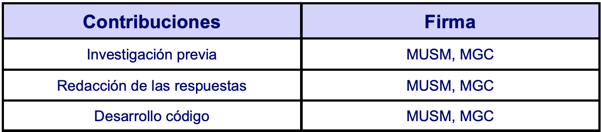

```{r setup, include=FALSE}
knitr::opts_chunk$set(echo = TRUE)
```

```{r load_libraries, include=FALSE}
library(knitr)
library(lubridate)
library(VIM)
library(stringr)
library(psych)
library(readr)
library(pROC)
library(dplyr)
library(nortest)
library(PerformanceAnalytics)
library(ggplot2)
```

****
# 1. Descripción del dataset. 
****

El dataset que hemos selecionado contiene datos de los 100 juegos de Google Play Store mejor valorados. Las variables que recoge el dataset son:

- Rank: Calsificación de una categoría particular.
- Title: Nombre del juego.
- Total ranting: Número total de calificaciones.
- Installs: Número de intalaciones aproximado.
- Average rating: Promedio de estrellas.
- growth (30 days): Porcentaje de crecimiento en 30 días.
- growth (60 days): Porcentaje de crecimiento en 60 días.
- price: Precio en Dolares.
- category: Cantegoria del juego. 
- X5.star.ratings: Número de calificaciones de 5 estrellas.
- X4.star.ratings: Número de calificaciones de 4 estrellas.
- X3.star.ratings: Número de calificaciones de 3 estrellas.
- X2.star.ratings: Número de calificaciones de 2 estrellas.
- X1.star.ratings: Número de calificaciones de 1 estrellas.
- paid: Toma valor verdadero si se pago y falso si no se hizo.

### ¿Por qué es importante y qué pregunta/problema pretende responder?

Una vez que conocemos las variables que componen el dataset, pasamos a definir cuál es la pregunta que tratamos de resolver y por qué es importante este dastaset.

Como bien sabemos el mundo de los videojuegos ha cambiado completamente en la última década, es decir, antes solo se podía jugar a través de consolas "fijas" como la Nintendo 64, la PlayStation... Posteriormente aparecieron las consolas portátiles, algunas de las más importantes fueron la Game Boy, la PlayStationg Portable...

Desde que apareció el primer videojuego en 1958 con el conocido "Tennis for two" de William Higinbotham y Robert Dvorak, la tendencia era la misma en cuanto al desarrollo de los juegos, el cómo venderlos, cómo hacer que llegaran a más gente, cómo de buenos eran... 

El tiempo avanzaba y parecía que esta industria seguía igual, sin embargo hubo un hecho importante, la aparición de los smartphones. Esta nueva herramienta ha cambiado en todos los aspectos como se rige el mundo, lo que supone también un cambio en la industria de los videojuegos, es decir, ahora la gran mayaría del público gamer juega más en dipositivos móviles que en las consolas tradicionales.

Al tener mayor audiencia aumenta la oferta, por lo que analizar este dataset nos puede aportar mucha información, por ejemplo el saber qué tipo de juego va a tener más éxito, si se decide poner un precio al juego y de ser así cuál, qué categoría de juego tiene un mayor público...

Como podemos observar este dataset nos puede proporcionar mucha información en varios aspectos, pero en nuestro caso vamos a analizar exclusivamente el rank, es decir, vamor a descubrir de qué depende que un juego tenga un ranking mayor o en otras palabras, cuánto éxito puede tener. Para ello además de analizar qué variables están correlacionadas, vamos a realizar un contraste de hipótesis para saber si el número de instalaciones afecta al ranking, y crearemos diferentes modelos para predecir el ranking que puede llegar a tener un juego dependiendo de sus características... 

La respuesta a la pregunta que nos hemos planteado se resolverá a lo largo de la práctica, pero lo primero de todo es hacer la limpieza del dataset.

****
# 2. Integración y selección de los datos de interés a analizar.
****
## 2.1. Integración de los datos.

En primer lugar, realizamos la carga del fichero que contiene los datos para nuestro análisis en formato csv, el cual está delimitado por comas y los decismales "·". Obtenemos como resultado de la llamada a la función read.csv() será un objeto data.frame.
 
```{r, echo=TRUE}
# read data
games <- read.csv("../data/android-games.csv", header=TRUE, sep=",",
                  na.strings="NA", dec=".", strip.white=TRUE)

n.var <- names(games)

#View(games)
```

Mostramos las primeras lineas del dataset, así como su encabezado.

```{r, echo=TRUE}
head(games)
```

Una vez cargados los datos comprobamos que nuestro fichero contiene `r nrow(games)` registros y `r ncol(games)` variables.

Las variables son de tipo `r toString(n.var)`.

Como podemos en el resumen de los estadisticos descriptivos de las distintas variables no hay ningún campo no informado.

```{r, echo=TRUE}
summary(games)
```

### 2.2. Tipo variables.

Comprobamos de que tipo es cada variable.

```{r, echo=TRUE}
#read data
res <- sapply(games,  class)
kable(data.frame(variables=names(res),clase=as.vector(res)))

```

A continuación analizamos en mayor profundidad los distintos valores que toman las variables categóricas.

```{r, echo=TRUE}
title <-unique(games$title)
head(title)
unique(games$category)
unique(games$installs)
unique(games$paid)
```

Observamos que la variable title toma un valor distinto para cada registro. Más adelante trataresmos el resto de variables que sean necesarias para nuestro análisis.

## 2.3. Selección de variables.

Para nuestro análisis vamos a eliminar del dataset los campos calculados, en nuetro caso son la media de estrellas que es la variable **average.rating, paid y total.ratings**. Por otro lado, para nuestro análisis es suficiente con uno de los porcentajes de crecimiento por tanto eliminamos tambien la variable **growth..60.days**. El resto de variables consideramos que son necesarias para el objetivo de nuesto análisis, ver como influyen en el ranking de un video juego.

```{r, echo=TRUE}
games <-games[,c(-3,-5,-7,-15)] # Elimienamos las variables en cuestión.

head(games)
```

Como resusltado obtenemos un dataset que contiene `r nrow(games)` registros y `r ncol(games)` variables.
Las variables son de tipo `r toString(n.var)`.

****
# 3. Limpieza de los datos.
****

Con el archivo de datos obtenido del proceso anterior, vemos la necesidad, para  seguir con nuestro análisis, de factorizar la variable **Category** y reconvertir a numérica la variable **Installs**.

A continuación, damos un valor numérico del 1 al 17 a los valores que toma la variable **Category**.

```{r, echo=TRUE}
levels <- c(unique(games$category))
games$category_num <- match(games$category, levels)
games$category_factor = factor(games$category, levels = levels)
games$category_num2 <- as.integer(games$category_factor)

head(games)
```

En el caso de la variable **Install** hemos supuesto que M millones y que k son miles, por lo que hemos multiplicado la M por 10^6 para pasalo a bytes y k por 10^3.

```{r, echo=TRUE}
converter<-function(valueToConvert) {
   intValue <- 0
   intValue <- strtoi(substr(valueToConvert, 1, regexpr('\\.', valueToConvert)-1))
    if (grepl("M", valueToConvert, ignore.case = TRUE)) {
        intValue <- intValue * (10**6)
    }
    if (grepl("K", valueToConvert, ignore.case = TRUE)) {
       intValue <- intValue * (10**3)
    }
   intValue
}
games$int_installs <- sapply(games$installs, FUN=converter)
head(games)
```


Selecionamos las variables con las que vamos a hacer nuestro análisis.

```{r, echo=TRUE}
games <-games[,c(-3,-6,-12,-13)] # Elimienamos las variables en variables que sobran
```

Finalmente, tras tratar las variables mal informadas nos queda nuestro dataset final sobre el que vamos a plicar la limpieza de datos y posteriormente el análisis.

```{r, echo=TRUE}
#read data
res <- sapply(games,  class)
kable(data.frame(variables=names(res),clase=as.vector(res)))
```

Como podemos ver solo nos hemos quedado con una varible categoricas **Title**y el resto las hemos reconvertido en númericas.

##    3.1. ¿Los datos contienen ceros o elementos vacíos? ¿Cómo gestionarías cada uno de estos casos?

Como se puede comprobar en el resumen de los estadisticos descriptivos de las distintas variables, no hay ningún valor nulo.

```{r, echo=TRUE}
summary(games)
```

Con la función summary vemos si existen valores nulos y cual es el valor maximo y minimo que toma cada variable. La variable price toma valor cero pero es de interes para el análisis ya que significa que el usuario no ha pagando nada. Por otro lado, la variable growth..30.days. también toma valor 0 en el caso de no haber crecimiento.

##    3.2. Identificación y tratamiento de valores extremos.

Los valores extremos o outliers son aquellos que parecen no ser congruentes sin los comparamos con el resto de los datos. Para identificarlos, podemos hacer uso de dos vías: (1) representar un diagrama de caja por cada variable y ver qué valores distan mucho del rango intercuartílico (la caja) o (2) utilizar la función boxplots.stats() de R, la cual se emplea a continuación. Así, se mostrarán sólo los valores atípicos para aquellas variables que los contienen:

```{r, echo=TRUE}
boxplot.stats(games$rank)$out

```
```{r, echo=TRUE}
boxplot.stats(games$int_installs)$out
```

```{r, echo=TRUE}
out_growth <- boxplot.stats(games$growth..30.days.)$out
head(out_growth)
```

```{r, echo=TRUE}
boxplot.stats(games$price)$out
```

```{r, echo=TRUE}
out_X5 <- boxplot.stats(games$X5.star.ratings)$out
head(out_X5)
```

```{r, echo=TRUE}
out_X4 <- boxplot.stats(games$X4.star.ratings)$out
head(out_X4)
```


```{r, echo=TRUE}
out_X3 <- boxplot.stats(games$X3.star.ratings)$out
head(out_X3)
```


```{r, echo=TRUE}
out_X2 <- boxplot.stats(games$X2.star.ratings)$out
head(out_X2)
```


```{r, echo=TRUE}
out_X1 <- boxplot.stats(games$X1.star.ratings)$out
head(out_X1)
```

Vemos una representación gráfica con boxplot de las variables númericas para comprobar si existen valores extremos.

```{r boxplot,eval=TRUE,echo=TRUE}
par(mfrow=c(3,2))
for(i in 1:ncol(games)) {
  if (is.numeric(games[,i])){
    boxplot(games[,i], main = colnames(games)[i], width = 100)
  }
}
par(mfrow=c(1,1))
```

Se considera valores extremos a aquellos valores cuando se encuentra alejado 3 desviaciones estándar con respecto a la media. Por ello, en muchos trabajos se utiliza la representación de los datos mediante gráficos de cajas (boxplots), con el objetivo de detectar dichos outliers.

Gráficamente vemos que las variables con valores muy por encima de la medía son paid, que no se puede considerar outliers ya que la mayoría de lo juegos son gratuitos, también int_install está muy por encima de la media pero no parece ser incorrecto porque es posible que hayas juegos con más megas que otros.

Las variables que si es posible que sean erroneos porque con fines mal intensionados se puede haber añadido excesivas valaraciones a un juego por medios automaticos (Robot) de forma que se pueden haber valores extemos estas son:
 - growth..30.days.
 - X5.star.ratings    
 - X4.star.ratings   
 - X3.star.ratings
 - X2.star.ratings   
 - X1.star.ratings 
 
 Es por ello, que hemos decidido elinminar estos valores.
 
```{r, echo=TRUE}
filas_old <-nrow(games)
games <- games[-which(games$growth..30.days. %in% out_growth),]
games <- games[-which(games$X5.star.ratings %in% out_X5),]
games <- games[-which(games$X4.star.ratings %in% out_X4),]
games <- games[-which(games$X3.star.ratings %in% out_X3),]
games <- games[-which(games$X2.star.ratings %in% out_X2),]
newgames <- games[-which(games$X1.star.ratings %in% out_X1),]
filas_new <-nrow(newgames)
```
 
Una vez eliminados los outlier, comprobamos gráficamente como se distribuyen los datos de estas variables.
 
```{r ,echo=TRUE}
par(mfrow=c(3,2))
for(i in 1:ncol(newgames)) {
  if (is.numeric(newgames[,i])){
    boxplot(newgames[,i], main = colnames(newgames)[i], width = 100)
  }
}
par(mfrow=c(1,2))
```

Hemos pasado de `r filas_old` filas a `r filas_new` filas.

Por último, exportamos el nuevo dataset a un nuevo csv.

```{r, echo=TRUE}
my.newfile <- "../data/newgame.csv"
write.csv(newgames, file=my.newfile, row.names = FALSE)

```

****
# 4. Análisis de los datos.
****
## 4.1. Selección de los grupos de datos que se quieren analizar/comparar (planificación de los análisis a aplicar).

Antes de comenzar con el análisis en sí, vamos a seleccionar diferentes grupos que pueden ser interesantes a la hora de analizar o comparar. Cabe destacar que no todos los grupos se van usar, pero pueden ser de utilidad para estudios posteriores, es decir, en el dataset original la variable rank viene determinada para cada categoría (si la categoría es "SPORTS" rank toma valores del 1 al 100 para los juegos de tipo sport, si la categoría es "STRATEGY" rank vuelve a tomar valores entre 1 y 100 para los juegos de dicha categoría). Como el objetivo nuestro es analizar el ranking, éste solo tiene sentido analizarlo para cada categoría de juego, es por ello que las agrupaciones las vamos a hacer por categoría.

Por otro lado, vamos a crear un par de grupos más que nos van a servir para solventar la pregunta que nos hacemos en el contraste de hipótesis, la cual la detallaremos más adelante:

```{r}
# Juegos cuya categoría es GAME ACTION
newgames.action = newgames[newgames$category_num2 == 1,]

# Juegos cuya categoría es GAME ADVENTURE
newgames.adventure = newgames[newgames$category_num2 == 2,]

# Juegos cuya categoría es GAME ARCADE
newgames.arcade = newgames[newgames$category_num2 == 3,]

# Juegos cuya categoría es GAME BOARD
newgames.board = newgames[newgames$category_num2 == 4,]

# Juegos cuya categoría es GAME CARD
newgames.card = newgames[newgames$category_num2 == 5,]

# Juegos cuya categoría es GAME CASINO
newgames.casino = newgames[newgames$category_num2 == 6,]

# Juegos cuya categoría es GAME CASUAL
newgames.casual = newgames[newgames$category_num2 == 7,]

# Juegos cuya categoría es GAME EDUCATIONAL
newgames.educational = newgames[newgames$category_num2 == 8,]

# Juegos cuya categoría es GAME MUSIC
newgames.music = newgames[newgames$category_num2 == 9,]

# Juegos cuya categoría es GAME PUZZLE
newgames.puzzle = newgames[newgames$category_num2 == 10,]

# Juegos cuya categoría es GAME RACING
newgames.racing = newgames[newgames$category_num2 == 11,]

# Juegos cuya categoría es GAME ROLE PLAYING
newgames.role = newgames[newgames$category_num2 == 12,]

# Juegos cuya categoría es GAME SIMULATION
newgames.simulation = newgames[newgames$category_num2 == 13,]

# Juegos cuya categoría es GAME SPORTS
newgames.sports = newgames[newgames$category_num2 == 14,]

# Juegos cuya categoría es GAME STRATEGY
newgames.strategy = newgames[newgames$category_num2 == 15,]

# Juegos cuya categoría es GAME TRIVIA
newgames.trivia = newgames[newgames$category_num2 == 16,]

# Juegos cuya categoría es GAME WORD
newgames.word = newgames[newgames$category_num2 == 17,]

# Juegos cuya categoría es GAME WORD y tiene un número de instalaciones bajas
newgames.ins_low = newgames.word[newgames.word$int_installs < 10000000,]

# Juegos cuya categoría es GAME WORD y tiene un número de instalaciones bajas
newgames.ins_high = newgames.word[newgames.word$int_installs >= 10000000,]


```


## 4.2. Comprobación de la normalidad y homogeneidad de la varianza.

Una vez que tenemos los grupos que queremos analizar/comparar vamos a comprobar la normalidad y homogeneidad de la varianza.

Dado que el objetivo de esta práctica es demostrar el conocimiento adquirido y no hacer un estudio completo, vamos a realizar el análisis de los datos a partir de un grupo definido en el apartado anterior, en nuestro caso hemos elegido la categoría "GAME WORD", por lo que vamos a hacer uso del dataframe newgames.word. El estudio que vamos a realizar para esta categoría se podría hacer para todas las demás y así tener un análisis completo del mercado para cada categoría.

Una vez hecha esta aclaración realizamos la **comprobación de la normalidad**, para ello hacemos uso de una librería externa y poder aplicar sobre las variables cuantitativas el test de Anderson-Darling.

Paratimos de la base que la hipótesis nula es que la variable sigue una distribución normal, y la hipótesis alternativa que no sigue dicha distribución, por lo tanto vamos a comprobar para cada variable si el pvalor obtenido es menor que el nivel de significacia, es decir, si pvalor < alfa, de ser así podemos rechazar la hipótesis nula a favor de la aternativa.

Definimos la función que nos realiza este cálculo:

```{r}
test_normalidad = function(df, alpha = 0.05) {
  # Inicializamos
  var_no_dist_normal = c()
  var_dist_normal = c()
  cols_eliminar = c()
  col_names = colnames(df)
  
  # Comprobamos que las variables tengan más de un valor único, 
  # ya que de lo contrario no funciona ad.test
  for (i in 1:ncol(df)) {
     if (is.numeric(df[, i]) | is.integer(df[, i])) { 
       if (length(unique(df[, i])) == 1) 
          cols_eliminar[length(cols_eliminar) + 1] = col_names[i]
     }
  }
  
  # Eliminamos dichas variables
  df = df[, !(names(df) %in% cols_eliminar)]
  
  # Añadimos dichas variables a la lista de variables que no siguen 
  # una distribución normal
  for (i in 1:length(cols_eliminar)) {
    var_no_dist_normal[i] = cols_eliminar[i]
  }
  
  # Comprobamos para cada columna si sigue una distribución normal o no
  col_names = colnames(df)
  for (i in 1:ncol(df)) {
    
    if (is.numeric(df[, i]) | is.integer(df[, i])) {
      pvalue = ad.test(df[, i])$p.value
      
      # No proviene de una distribución normal
      if (pvalue < alpha) {
        var_no_dist_normal[length(var_no_dist_normal) + 1] = col_names[i]
      } else {
        var_dist_normal[length(var_dist_normal) + 1] = col_names[i]
      }
    }
  }
  
  # Imprimimos por pantalla los resultado
  cat("Variables que NO siguen una distribución normal: \n\n")
  for (c in var_no_dist_normal) {
    cat(c, "\n")
  }
  cat("\n------------------------------\n\n")
  cat("Variables que SÍ siguen una distribución normal: \n\n")
  for (c in var_dist_normal) {
    cat(c, " ")
  }
}
```

Una vez que hemos definido la función la llamamos para obtener los resultados:
```{r}
test_normalidad(newgames.word, alpha = 0.05)
```

De la anterior ejecución vemos que para la categoría "GAME WORD", todas las variables cuantitativas no siguen una distribución normal.

Para concluir con este apartado realizamos el estudio de la homogeneidad de la varianza. En este caso la hipótesis nula es que las varianzas son iguales y la alternativa en caso contrario. Si el pvalor es menor que alfa rechazamos la hipótesis nula a favor de la alternativa.

**El análisis de la homogeneidad** lo vamos a realizar con el fin de saber qué estadístico tenemos que aplicar para el contraste de hipótesis, por lo que vamos a tener cuenta las muestras de el ranking de un juego cuya categoría sea "GAME WORD" y con descargas altas, por otro lado el ranking de un juego cuya categoría sea "GAME WORD" y con descargas bajas, para ello útilizaremos en contraste de hipotesisis F de Fisher:

```{r}
var.test(newgames.ins_low$rank, newgames.ins_high$rank, conf.level = 0.95)
```

Tal y como podemos apreciar en la anterior ejecución obtenemos un pvalor = 0.8599 > alfa = 0.05, como el pvalor es mayor que la alfa no podemos rechazar la hipótesis nula, por lo tanto las varianzas de ambas muestras son homogéneas con un nivel de significancia del 0.05.

## 4.3. Aplicación de pruebas estadísticas para comparar los grupos de datos. 

### En función de los datos y el objetivo del estudio, aplicar pruebas de contraste de hipótesis, correlaciones, regresiones, etc. Aplicar al menos tres métodos de análisis diferentes.

#### 4.3.1 ¿Qué variables cuantitativas influyen más en el ranking?

En este apartado lo que vamos realizar es calcular la correlacion que hay entre cada una de las variables cuantitativas respecto al ranking, pero si la variable cuantitativa solo toma un valor la eliminamos para calcular la correlación:

```{r}
correlacion = function(df) {
  
  cols_eliminar = c()
  col_names = colnames(df)
  
  # Comprobamos que las variables tengan más de un valor único, 
  # ya que de lo contrario no funciona ad.test
  for (i in 1:ncol(df)) {
     if (is.numeric(df[, i]) | is.integer(df[, i])) { 
       if (length(unique(df[, i])) == 1) 
         cols_eliminar[length(cols_eliminar) + 1] = col_names[i]
     }
  }
  
  # Eliminamos dichas variables
  df = df[, !(names(df) %in% cols_eliminar)]
  
  col_names = colnames(df)
  
  cat("Correlación respecto al campo \"rank\"\n")
  for (i in 2:ncol(df)) { # Comenzamos en dos ya que la primera 
                          #columna siempre es el ranking
    
    if (is.numeric(df[, i]) | is.integer(df[, i])) {
      value_corr = cor.test(df[, "rank"], df[, i])$estimate
      cat("\n", col_names[i], " ", value_corr)
    }
  }
  
  # for (i in 2:ncol(df)) {
  #   if (is.numeric(df[, i]) | is.integer(df[, i])) {
  #     chart.Correlation(data.frame(df[, "rank"], df[, i]))
  #   }
  # }
  
}
```

Una vez definida la función que nos devuelve la correlación de cada variable respecto al ranking, la llamamos:

```{r}
correlacion(newgames.word)
```

Como podemos apreciar, el crecimiento en los últimos 30 días está muy poco correlacionado con el rank. Sin embargo vemos que los ratings están altamente correlacionados de forma inversa, es decir, cuanto más pequeño sea el número del ranking (mejor juego es) más valoraciones tiene de 5, 4 y 3 estrellas, y a medida que el ranking aumenta (peor es el juego) menos valoraciones positivas recibe el mismo.

Otro aspecto a tener en cuenta es que cuanto mejor sea el juego (menor número en el rank) más descargas se producen del mismo.

Por lo tanto, vemos que estas variables influyen altamente en el ranking del juego.

Otra forma de calcular la correlación de forma más detallada junto con la distribución de cada variable y cómo de importante es cada una de ellas sería haciendo uso de una librería externa, las conclusiones que obtenemos son las mismas que en el caso anterior:

```{r}
chart.Correlation(data.frame(newgames.word$rank, newgames.word$growth..30.days.))
chart.Correlation(data.frame(newgames.word$rank, newgames.word$X5.star.ratings))
chart.Correlation(data.frame(newgames.word$rank, newgames.word$X4.star.ratings))
chart.Correlation(data.frame(newgames.word$rank, newgames.word$X3.star.ratings))
chart.Correlation(data.frame(newgames.word$rank, newgames.word$X2.star.ratings))
chart.Correlation(data.frame(newgames.word$rank, newgames.word$X1.star.ratings))
chart.Correlation(data.frame(newgames.word$rank, newgames.word$int_installs))
```

#### 4.3.2 ¿El ranking de los juegos de la categoría GAME WORD es superior en caso de tener unas instalaciones elevadas?  

Continuando con las pruebas estadísticas, ahora vamos a hacer un contraste de hipótesis de dos muestras sobre la media, utilizaremos la **Prueba de T-Studente** (t-test) Una muestra va a contener todos los juegos de la categoría GAME WORD cuyas descargas sean inferiores a 10 millones, y la seguna muestra va a contener los juego de la categoría GAME WORD cuyas descargas sean iguales o superiores a 10 millones:
```{r}
ranking.ins_low = newgames.ins_low$rank
ranking.ins_high = newgames.ins_high$rank
```

En este caso la hipótesis nula (H0) es que la media de ambas muestras son iguales, y la hipótesis alternativa (H1) la media de los juegos con instalaciones elevadas es mayor que la media de los juegos con instalaciones bajas:

H0: media_inst_elevadas = media_inst_bajas
H1: media_inst_elevadas > media_inst_bajas

Para aplicar el test de T-Student necesitamos asumir la normalidad de los datos, en nuestro caso podemos aplicar el Teorema del Límite Central, el cual nos indica que la media de una muestra que sea lo suficientemente grande (mayor de 30 observaciones) sigue una distribución normal. Al poder calcular la media de ambas muestras esto lo cumplimos, solo nos hace falta comprobar que tenemos el número de observaciones mínimas, pero tal y como vemos a continuación esto también se cumple:

```{r}
cat("El número de observaciones de instalaciones bajas es: ", nrow(newgames.ins_low))
cat("El número de observaciones de instalaciones altas es: ", nrow(newgames.ins_high))
```

Una vez asumida la normalidad, hacemos uso de la función t.test que nos devuelve el pvalor para este caso, consideramos un nivel de significancia del 0.05:
```{r}
t.test(ranking.ins_high, ranking.ins_low, alternative = "greater", var.equal = TRUE)
```

De la anterior ejecución vemos que el pvalor = 1 y alfa = 0.05, como el pvalor no es menor que la alfa no podemos rechazar la hipótesis nula, es decir, no podemos garantizar que el ranking de un juego cuya categoría es GAME WORD y el número de instalaciones sea elevado tenga un ranking superior que un juego de la misma categoría pero con un número de instalaciones bajo.

#### 4.3.3 Modelo de regresión lineal  

Tal y como se definió en el primer apartado de la práctica, podría ser interesante el predecir qué ranking va a tener nuestro juego dentro de la categorñia GAME WORD, esto podría sernos de utilidad para saber si nuestro juego va a tener éxisto o no dependiendo  de las características que lo definen, como por ejemplo: el rating, el número de instalaciones...

Como a priori no sabemos qué modelo se va a comportar mejor para nuestros datos, vamos a crear diferentes modelos de regresión lineal, posteriormente comprobaremos qué modelo se comporta mejor y usaremos éste para hacer una predicción.

Para evaluar qué modelo es el mejor nos fijaremos en la medida estadística R2, ésta nos indica cómo de cerca están los datos respecto a la recta de regresión, o dicho en otras palabras cuánta variabilidad es explicado por el modelo, por lo que a mayor R2 mejor es el modelo.

Para definir un modelo de regresión lineal tenemos que determinar cuál es la variable objetivo, en nuestro caso el campo "rank" y las variables independientes.

Para el primer modelo vamos a usar como variable independientes solamente el crecimiento en 30 días y el número de instalaciones:

```{r}
m1_rlm = lm(rank ~ growth..30.days. + int_installs, data = newgames.word)
```

En el segundo modelo vamos a continuar con el número de instalaciones, pero añadimos los ratings de 5, 3 y 1 estrellas:

```{r}
m2_rlm = lm(rank ~ X5.star.ratings + X3.star.ratings + X1.star.ratings + int_installs, 
            data = newgames.word)
```

El último modelo es similar al anterior, pero añadiendo los ratings de 4 y 2 estrellas:

```{r}
m3_rlm = lm(rank ~ X5.star.ratings + X4.star.ratings + X3.star.ratings + X2.star.ratings +
            X1.star.ratings + int_installs, data = newgames.word)
```

Una vez que hemos creado todos los modelos obtenemos el coeficiente de determinación (R2) para cada uno de ellos:

```{r}
vec_modelos = c("Modelo 1", "Modelo 2", "Modelo 3")
vec_R2 = c(summary(m1_rlm)$r.squared, summary(m2_rlm)$r.squared,
           summary(m3_rlm)$r.squared)
df_R2 = data.frame(
  vec_modelos, 
  vec_R2
)
names(df_R2) = c("Modelos", "R2")

head(df_R2)
```

Observamos que el modelo que mejor se comporta con nuestros datos es el tercero, es decir, aquel en el que incluimos todas las variables significativas que están correlacionadas con la variable objetivo, en nuestro caso con rank.

Finalmente, vamos a predecir qué posición dentro del ranking tendría un juego creado para la categoría GAME WORD:

```{r}
head(newgames.word)
```


```{r}
# Creamos el dataframe con los valores para predecir
df_game = data.frame(
  X5.star.ratings = 945761,
  X4.star.ratings = 30156,
  X3.star.ratings = 5123,
  X2.star.ratings = 439,
  X1.star.ratings = 27899,
  int_installs = 5000000
)

# Predecimos el rank que tendría nuestro juego
cat("El rank que tendría nuestro juego sería el: ", round(predict(m3_rlm, df_game)))
```


****
# 5. Representación de los resultados a partir de tablas y gráficas.
****

Una vez que hemos realizado la limpieza y el análisis de datos, el cual no ha permitdo obtener información a partir de los mismos, vamos a continuar con el análisis pero de una forma visual, es decir, a partir de gráficos, de los cuales extraermos las conclusiones y las enlazaremos con el apartado anterior.

Pero antes de continuar, para facilitar la representación de la información, vamos a discretizar las variables significativas según el análisis hecho anteriormente, es decir, la variable rank, los ratings e int_installs:
```{r}
newgames_discretizado = newgames.word

# Discretización de rank
newgames_discretizado["d-rank"] = ordered(cut(newgames_discretizado[["rank"]],
                      breaks = c(0,26,74,100), labels = c("Alto", "Medio", "Bajo")))

# Discretización de X5.star.ratings
newgames_discretizado["d-X5.star.ratings"] = ordered(cut(newgames_discretizado[["X5.star.ratings"]],
                                             breaks = c(0,121285,284850,1395623),
                                             labels = c("Bajo", "Medio", "Alto")))
 
# Discretización de X4.star.ratings
newgames_discretizado["d-X4.star.ratings"] = ordered(cut(newgames_discretizado[["X4.star.ratings"]],
                                             breaks = c(0,21082,71891,222920), 
                                             labels = c("Bajo", "Medio", "Alto")))
 
# Discretización de X3.star.ratings
newgames_discretizado["d-X3.star.ratings"] = ordered(cut(newgames_discretizado[["X3.star.ratings"]],
                                             breaks = c(0,8884,29994,82726), 
                                             labels = c("Bajo", "Medio", "Alto")))
 
# Discretización de X2.star.ratings
newgames_discretizado["d-X2.star.ratings"] = ordered(cut(newgames_discretizado[["X2.star.ratings"]], 
                                             breaks = c(0,3011,10747,32652), 
                                             labels = c("Bajo", "Medio", "Alto")))
 
# Discretización de X1.star.ratings
newgames_discretizado["d-X1.star.ratings"] = ordered(cut(newgames_discretizado[["X1.star.ratings"]], 
                                             breaks = c(0,7122,26938,105952), 
                                             labels = c("Bajo", "Medio", "Alto")))
 
# Discretización de int_installs
newgames_discretizado["d-int_installs"] = ordered(cut(newgames_discretizado[["int_installs"]], 
                                          breaks = c(0, 9999999, 100000000), 
                                          labels = c("Bajo","Alto")))
```

Vemos el cómo se han creado dichas variables:
```{r}
str(newgames_discretizado)
head(newgames_discretizado)
```

Una vez que ya tenemos las variables discretizadas vamos a realizar la representación del análisis de estos datos. Lo primero que vamos a analizar es el ranking respecto al número de instalaciones, este fue el objeto de estudio del contraste de hipótesis:
```{r}
ggplot(data = newgames_discretizado, aes(x=`d-int_installs`,fill=`d-rank`)) + 
  geom_bar(position = "fill") +
  xlab("Número de instalaciones") +
  ylab("Frecuencia") +
  scale_fill_manual(name = "Rank", values=c("#00bfc4","#f8766d", "#fff300")) +
  ggtitle("Ranking respecto al número de instalaciones")
```

Del anterior gráfico vemos que a mayor número de instalaciones como es lógico un mayor ranking tenemos, pero tal y como vimos en el contraste de hipósteis esto no significa que siempre sea así, por lo que no podemos garantizar que si un juego tiene muchas descargas vaya a tener un ranking alto.

El siguiente aspecto a analizar es el número de estrellas que tiene cada juego y si esto significa un mayor ranking.

Por lo que primero vamos a analizar el número de calificaciones de 5 estrellas:
```{r}
ggplot(data = newgames_discretizado, aes(x=`d-X5.star.ratings`,fill=`d-rank`)) + 
  geom_bar(position = "fill") +
  xlab("Número de calificaciones de 5 estrellas") +
  ylab("Frecuencia") +
  scale_fill_manual(name = "Rank", values=c("#00bfc4","#f8766d", "#fff300")) +
  ggtitle("Ranking respecto al número de calificaciones de 5 estrellas")
```

Como podemos apreciar, aquellos juego que tienen un elevado número de calificaciones significa que el juego tiene un ranking mayor, por contra si el número de calificaciones es bajo es más probable tener un juego con un ranking bajo o medio.

Realizamos el mismo análisis pero para las calificacioens de 4 estrellas:
```{r}
ggplot(data = newgames_discretizado, aes(x=`d-X4.star.ratings`,fill=`d-rank`)) + 
  geom_bar(position = "fill") +
  xlab("Número de calificaciones de 4 estrellas") +
  ylab("Frecuencia") +
  scale_fill_manual(name = "Rank", values=c("#00bfc4","#f8766d", "#fff300")) +
  ggtitle("Ranking respecto al número de calificaciones de 4 estrellas")
```

Al igual que sucedía antes, cuanto más elevado sea el número de calificaciones más probable que el juego tenga un ranking alto o medio, sin embargo si tenemos pocas calificaciones de cuatro estrellas la posición en el ranking va a ser peor.

Analizamos las calificaciones de 3 estrellas:
```{r}
ggplot(data = newgames_discretizado, aes(x=`d-X3.star.ratings`,fill=`d-rank`)) + 
  geom_bar(position = "fill") +
  xlab("Número de calificaciones de 3 estrellas") +
  ylab("Frecuencia") +
  scale_fill_manual(name = "Rank", values=c("#00bfc4","#f8766d", "#fff300")) +
  ggtitle("Ranking respecto al número de calificaciones de 3 estrellas")
```

Siguiendo con la tónica de los casos anterior, a mayor número de calificaciones de 3 estrellas mejor posición en el ranking y a menor número peor posición.

Seguimos analizando las calificaciones de 2 estrellas:
```{r}
ggplot(data = newgames_discretizado, aes(x=`d-X2.star.ratings`,fill=`d-rank`)) + 
  geom_bar(position = "fill") +
  xlab("Número de calificaciones de 2 estrellas") +
  ylab("Frecuencia") +
  scale_fill_manual(name = "Rank", values=c("#00bfc4","#f8766d", "#fff300")) +
  ggtitle("Ranking respecto al número de calificaciones de 2 estrellas")
```

Aunque lo lógico sería que a medida que vamos reduciendo las estrellas de un juego su ranking sea peor, vemos que esto no es del todo cierto, ya que en este caso los juegos que siguen teniendo un elevado número de calificaciones de 2 estrellas siguen con un ranking elevado.

Esto solo tiene una explicación, y es que lo juegos mejor posicionados en el ranking tienen un mayor número de calificaciones en todos los niveles, es decir, tanto en 5 como 4, 3, 2 o una estrella. Por lo tanto, al hacer el análisis del ranking para cada nivel de califación vemos que los juegos con una alta posición siempre tienen el mayor número de calificaciones (aunque en este caso una califiación de 2 estrellas sea algo negativo), por otro lado, esto no significa que los juegos con una posición baja en el ranking tengan bajo cada uno de los niveles de califiación, seguramente el número de calificaciones para cada nivel sea menor que los juego mejor posicionados, pero en comparativa éstos tienen peores calificaciones.  

Por último, analizamos el número de calificaciones de 1 estrellas:
```{r}
ggplot(data = newgames_discretizado, aes(x=`d-X1.star.ratings`,fill=`d-rank`)) + 
  geom_bar(position = "fill") +
  xlab("Número de calificaciones de 1 estrellas") +
  ylab("Frecuencia") +
  scale_fill_manual(name = "Rank", values=c("#00bfc4","#f8766d", "#fff300")) +
  ggtitle("Ranking respecto al número de calificaciones de 1 estrellas")
```

Al igual que sucedía en el caso anterior, los juegos mejor posicionados en el ranking tienen un mayor número de calificaciones de 1 estrella, pero esto se debe a que tienen un mayor número de calificaciones en todos los niveles, pero en comparativa los juegos con peor ranking tienen peores valoraciones en todos los niveles.

****
# 6. Resolución del problema. 
****
### A partir de los resultados obtenidos, ¿cuáles son las conclusiones? ¿Los resultados permiten responder al problema?

El objetivo de esta práctica más que resolver un problema a sido dar respuesta ha una serie de preguntas, la principal de ellas, ¿Cómo que variables afecta a que ranking de un video juego sea mayor o menor? ¿El ranking de los juegos de una categoría determinada es superior en caso de tener unas instalaciones elevadas?  

A lo largo de práctica hemos dado respuestas a estas preguntas, a demás de desarrollar un modelo de regresión lineal que nos permite predecir cual será el puesto en el ranking de un video juego determinado.

Del análisis realizado podemos concluir, que las variables que más influyen sobre el puesto que ocupa un video juego en el ranking son el número de estrellas obtenidas, a mayor número de estrellas más alto es el puesto del video juego en el ranking, esto lo hemos comprobado estudiando la correlación de las variables cuantitativas con el ranking. En el análisis gráfico hemos podido ver que hay categorías de juegos que a mayor número de instalaciones mayor es su puesto en el ranking pero está afirmación no se puede extender a todas las categorías.

Por último, hemos desarrollado un modelo de regresión lineal con las variables ranking, calificación en estrellas (X1, X2, X3, X4, X5) y número de instalaciones, que tras analizar distinto modelo este es el que ha obtenido un coeficiente de determinación (R cuadrado) mayor.  Este modelo nos ha permitido hacer la predicción de la posición de una categoría determinada en el ranking. Esto se puede trasladar a cualquier categoría de nuestro dataset. Esto es de gran utilidad en caso de querer invertir en un video juego o querer publicitarnos en el mismo, podríamos elegir un video juego que tendrá éxito.

***
# 7. Código: 
***
Como se opuede observar el código se ha realizado en R.  

Para el desarrollo de la práctica se ha seguido la siguiente metodología desarrollada en cuatro etapas:

**Fase 1**: Se realiza la comprensión y contextualización de los datos a los cuáles se les va a realizar el análisis. Con ellos identificamos
si existen problemas de calidad y se identifican los datos que necesitan ser limpiados.

**Fase 2**: Se definen los métodos a realizar solventar los problemas identificados y se realiza el proceso de limpieza de datos.

**Fase 3**: Se realiza el análisis por medio de métodos estadísticos descriptivos e inferenciales.

**Fase 4**: Se analizan los resultados obtenidos del proceso anterior, formulando las conclusiones que se desprenden de los resultados.

***
# 8.Tabla de contribuciones al trabajo:
***

```{r eval = TRUE, echo = TRUE}

```

MUSM: Mario Ubierna San Mamés.

MGC: Moreyba García Cedrés.
